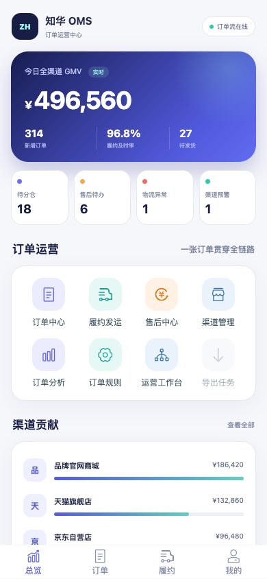
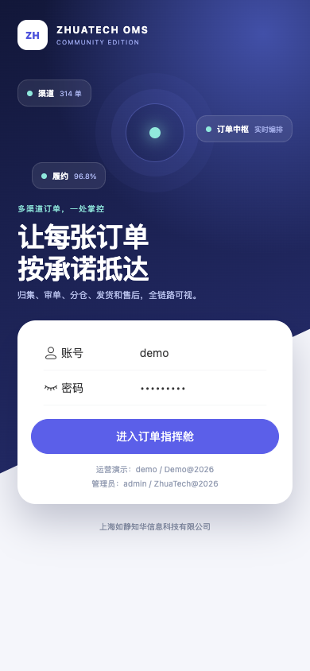
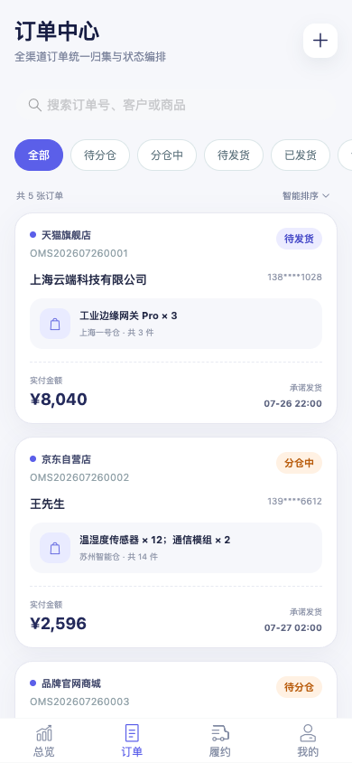
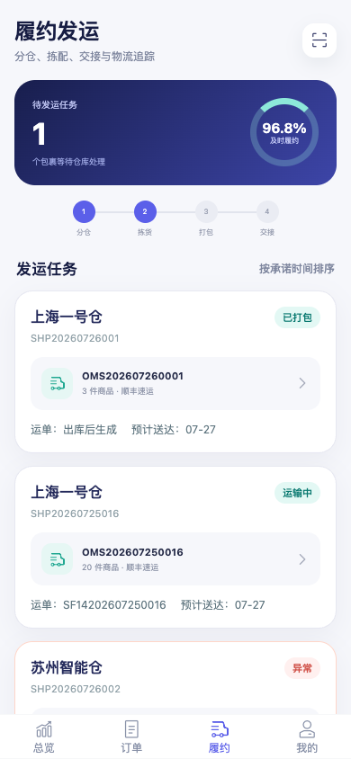
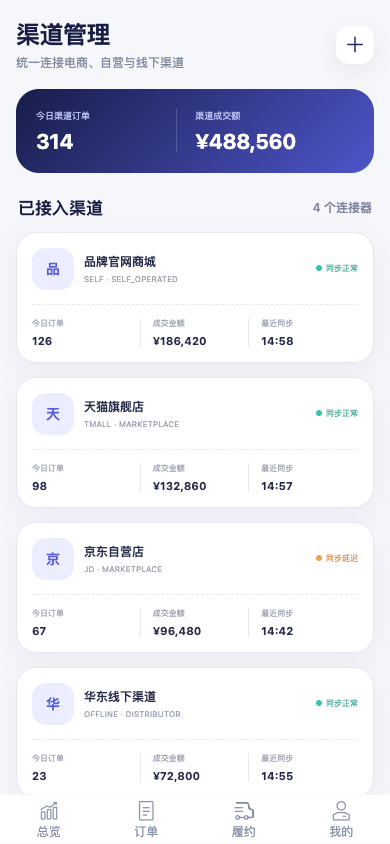
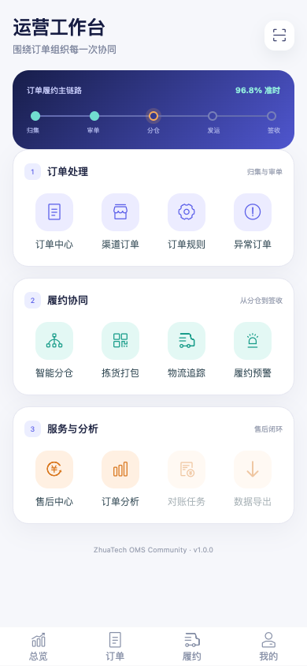

<div align="center">

# ZhuaTech OMS

### 知华科技订单管理系统 · 社区源码版

把多渠道订单汇入同一个中枢，让审单、分仓、发运、物流和售后沿着一条清晰的履约链流转。

[官方网站](https://www.zhuatech.cn/) · [快速启动](#本地运行) · [页面实录](#真实页面实录) · [接口文档](docs/API.md) · [商业授权](#深度定制与商业授权)

</div>

## 企业级增强：订单履约放行治理

新增反欺诈、出口管制、付款、地址、库存、价格、信用和人工例外联合门禁，详见 [订单放行治理](docs/ENTERPRISE_ORDER_RELEASE.md)。

## 企业级增强：订单取消与退款

新增取消政策、发运拦截、库存释放、原支付关联、退款金额、促销回退、税务处理、欺诈复核、客户身份、财务/业务批准、职责分离和审计证据门禁，详见[订单取消退款治理](docs/ENTERPRISE_ORDER_CANCELLATION_REFUND.md)。

> [!IMPORTANT]
> 本工程版权归 **上海如静知华信息科技有限公司** 所有，仅允许个人学习及非商业交流。未经书面授权，不得用于公司经营、客户项目、SaaS 服务、收费培训或其他商业用途。完整条款见 [LICENSE](LICENSE)。



## 多节点订单分仓

新增 `POST /api/oms/insights/order-allocation`：对各履约节点的可用库存、时效、距离和负载进行排序，优先选择可整单履约的最优节点；单节点库存不足时，在允许的拆单上限内生成跨节点方案，仍不足则返回缺货预占与客服处理建议。

## 从一张订单开始

一个订单从天猫、京东、品牌商城或线下渠道进入系统后，会经历归集、支付确认、智能分仓、拣货打包、物流交接、签收与售后。ZhuaTech OMS 将这段过程组织为可追踪的状态与事件：

```text
渠道订单
   │
   ▼
统一归集 ──→ 风险审单 ──→ 智能分仓 ──→ 拣货打包 ──→ 物流发运 ──→ 签收完成
   │             │             │             │             │
渠道映射       订单规则       库存路由       发运任务       轨迹回传
                                                               │
                                                               ▼
                                                         退款 / 退货 / 换货
```

第一版刻意保持业务边界清晰：它不是 ERP 的缩写版本，而是围绕订单生命周期设计的独立 OMS 学习工程。

## 真实页面实录

下面图片均由本仓库前端实际运行后截取，界面采用 390 × 844 移动 H5 视口。

<table>
  <tr>
    <td width="50%" align="center"><br/><b>品牌登录页</b><br/>多渠道订单网络与演示账号入口</td>
    <td width="50%" align="center"><br/><b>订单指挥舱</b><br/>GMV、订单量、履约指标、渠道贡献与实时动态</td>
  </tr>
  <tr>
    <td width="50%" align="center"><br/><b>订单中心</b><br/>全渠道订单、状态筛选、客户、商品与承诺发货时间</td>
    <td width="50%" align="center"><br/><b>履约发运</b><br/>分仓、拣配、物流交接和异常任务</td>
  </tr>
  <tr>
    <td width="50%" align="center"><br/><b>渠道管理</b><br/>商城、平台与线下渠道连接和同步状态</td>
    <td width="50%" align="center"><br/><b>运营工作台</b><br/>订单处理、履约协同、售后服务与数据分析</td>
  </tr>
</table>

## 第一版业务能力

| 业务域 | 已实现能力 | 页面与接口关注点 |
| --- | --- | --- |
| 订单总览 | 今日 GMV、订单量、待分仓、待发货、售后和异常指标 | `/api/oms/dashboard` |
| 订单中心 | 多渠道订单归集、状态筛选、人工订单、状态流转 | 订单号、渠道单号、客户、商品、仓库、承诺时间 |
| 履约发运 | 发运任务、拣货打包、承运商、运单和物流异常 | 包裹状态、责任仓、预计送达时间 |
| 售后中心 | 仅退款、退货退款、换货与处理状态 | 售后单、原订单、原因、金额和处理人 |
| 渠道管理 | 自营商城、电商平台、经销与线下渠道 | 同步状态、订单量、成交额和最近同步时间 |
| 订单规则 | 分仓路由、高价值复核、时效承诺和售后分派 | 规则场景、命中次数和启停状态 |
| 订单分析 | GMV、客单价、履约及时率、售后率与渠道排行 | 移动端经营分析页面 |
| 安全基础 | JWT 登录、BCrypt 密码、角色权限、统一异常响应 | `ADMIN`、`MANAGER`、`SALES`、`WAREHOUSE` |

## 技术结构

```text
Vue 3 + Vant + Pinia
          │ REST / JSON
          ▼
Spring Boot 4 + Spring Security + JPA
          │
          ├── 订单 / 履约 / 售后 / 渠道 / 事件
          │
          ▼
        MySQL 8.4
```

- 前端：Vue 3、Vite、Vant、Pinia、Vue Router、Axios
- 后端：Java 21、Spring Boot、Spring Security、Spring Data JPA、JWT
- 数据库：MySQL 8.4、Flyway
- 部署：Docker、Docker Compose、Nginx
- Java 根包：`cn.zhuatech.oms`
- 数据库表前缀：`oms_`

更多设计说明见 [架构文档](docs/ARCHITECTURE.md)。

## 本地运行

### 方式一：Docker Compose

```bash
git clone https://github.com/zhihua-tech/zhuatech-oms.git
cd zhuatech-oms
docker compose up -d --build
```

浏览器访问：<http://localhost:8088>

```text
运营经理：demo / Demo@2026
订单专员：operator / Demo@2026
系统管理员：admin / ZhuaTech@2026
```

首次启动会生成渠道、订单、发运任务、售后单和订单事件示例数据。演示账号仅用于本地学习；任何获授权的联网部署必须修改数据库密码、演示密码和 `JWT_SECRET`。

停止服务：

```bash
docker compose down
```

### 方式二：前后端开发模式

后端需要 Java 21、Maven 3.9 和 MySQL 8：

```bash
cd backend
mvn spring-boot:run
```

前端需要 Node.js 24 与 npm：

```bash
cd frontend
npm ci
npm run dev
```

如只想浏览完整页面和示例数据，可使用前端内置演示模式：

```bash
npm run dev:demo
```

## 目录导航

```text
zhuatech-oms/
├── backend/                 Java / Spring Boot API
│   └── src/main/java/cn/zhuatech/oms/
├── frontend/                Vue 3 移动 H5
├── docs/                    架构、接口和产品截图
├── deploy/                  部署注意事项
├── compose.yaml             一键启动 MySQL、后端和前端
├── LICENSE                  社区源码许可协议
├── CONTRIBUTING.md          贡献说明
├── SECURITY.md              安全问题反馈
└── NOTICE                   公司与版权声明
```

## 当前边界与后续方向

当前版本用于展示 OMS 的核心领域模型与移动端体验，尚未连接真实电商平台、支付机构、WMS 或物流商。建议后续按业务需要扩展：

- 渠道连接器、Webhook 签名校验与幂等归集
- 订单拆分合并、预售、赠品、套装和复杂优惠分摊
- WMS 波次、电子面单、物流轨迹和超时预警
- 风控规则编排、库存中心与跨仓路由
- 财务对账、渠道结算和经营分析大屏
- PC 管理后台、多租户、消息队列、审计与可观测性

## 参与项目

提交代码前请阅读 [CONTRIBUTING.md](CONTRIBUTING.md) 和 [CODE_OF_CONDUCT.md](CODE_OF_CONDUCT.md)。安全漏洞不要提交公开 Issue，请按 [SECURITY.md](SECURITY.md) 中的方式联系维护方。

## 深度定制与商业授权

本社区源码版用于个人学习 OMS 领域建模、Java 前后端分离架构和移动端企业应用设计。用于企业经营、客户交付、SaaS 服务、收费培训或任何其他商业场景前，必须获得 **知华科技（上海如静知华信息科技有限公司）** 的书面授权。

知华科技可提供 OMS 业务蓝图、多渠道连接、WMS/ERP/CRM 集成、PC 管理后台、移动端、私有化部署、数据迁移、性能治理与长期技术支持。

- 官网：[https://www.zhuatech.cn/](https://www.zhuatech.cn/)
- 项目与授权咨询：通过官网或下方任一微信二维码联系

<table>
  <tr>
    <td width="50%" align="center"></td>
    <td width="50%" align="center"></td>
  </tr>
  <tr>
    <td align="center">微信咨询一</td>
    <td align="center">微信咨询二</td>
  </tr>
</table>

## 许可与版权

Copyright © 2026 **上海如静知华信息科技有限公司**。保留所有权利。

本项目采用 **ZhuaTech OMS Community Source License 1.0（知华科技 OMS 社区源码许可协议）**，仅允许个人、非商业目的的学习、研究和交流。项目虽公开源代码，但该协议包含非商业限制，并非 OSI 认可的标准开源许可证。详情见 [LICENSE](LICENSE)。

---

**搜索关键词：** 知华科技 OMS、ZhuaTech OMS、Java OMS、Spring Boot 订单管理系统、Vue OMS、H5 OMS、MySQL OMS、多渠道订单系统、订单中台、订单履约系统、订单管理源码、售后管理系统、渠道订单管理、OMS 私有化部署、OMS 二次开发、上海 OMS 定制开发、企业数字化解决方案。

## 履约承诺评估器

订单中心新增 `POST /api/oms/insights/fulfillment-promise`，综合库存覆盖率、仓内积压、承运延误、承诺时效和 VIP 标记，返回履约风险分及 `ON_TIME / EXPEDITE / REPLAN` 决策。系统同时列出调仓、波次加急、物流时效确认等动作，让异常订单在真正超时之前进入人工处置队列。

接口使用现有 JWT 鉴权，并用高风险订单的集成测试锁定计算结果。

## 拆单合包决策

新增 `POST /api/oms/insights/shipment-consolidation`，对比当前运费与合包运费，并结合包裹数、重量、额外处理时间、承诺缓冲和易碎品属性输出 `CONSOLIDATE / REVIEW / KEEP_SPLIT`。接口同时返回预计节省、风险分和仓内执行动作，避免只追求运费节省而牺牲履约时效。

## 逆向退货路由

`POST /api/oms/insights/return-routing` 依据商品成色、签收时长、商品价值、翻新成本、逆向距离和可售库存缺口，在重新上架、翻新、人工质检和拒收复核之间选择路径，同时估算价值回收金额。

## AI 订单异常副驾驶

新增 `POST /api/oms/ai/order-exception`，使用承诺时限、库存齐套、付款、地址、承运商运力、客户优先级和拆单能力预测异常概率，生成内部处置和客户沟通建议。默认本地模式适合直接部署；配置 DeepSeek 或 OpenAI 兼容模型后，可增强备选履约方案和沟通文本。

检索关键词：AI OMS、智能订单系统、订单异常预测、履约风险、智能拆单、DeepSeek OMS、订单管理系统源码、知华科技 OMS。
